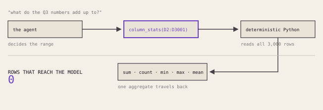
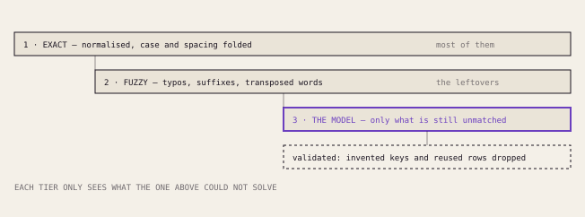
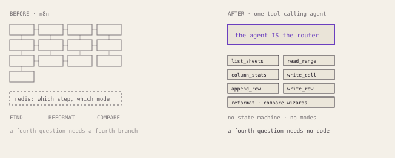
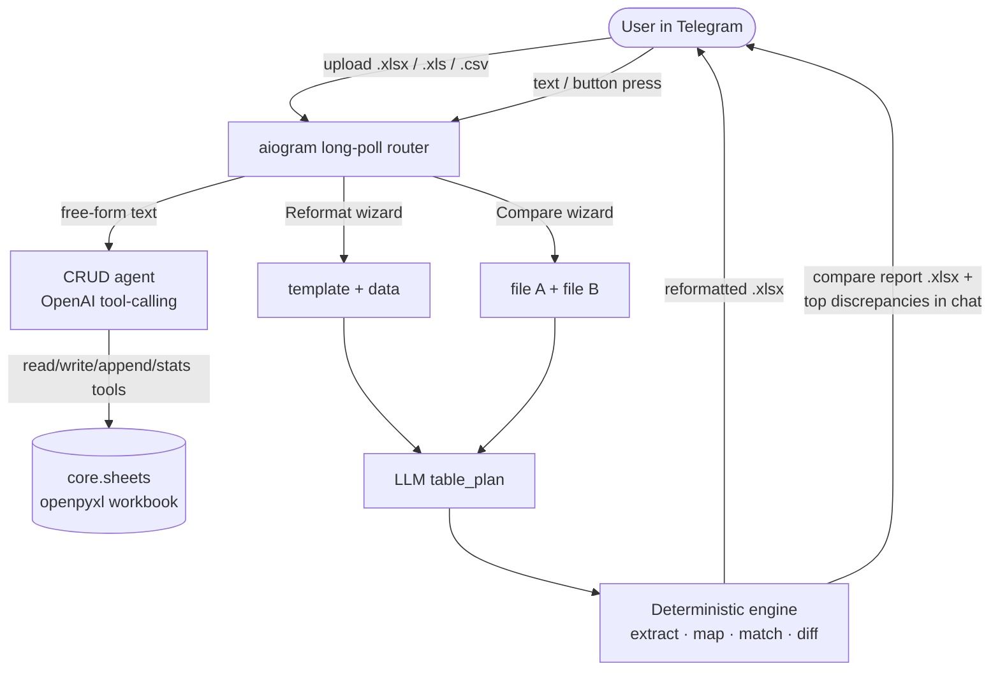

# Excel Table Bot

**Telegram spreadsheet bot: talk to an .xlsx to edit it, reformat messy exports into a template, and compare two files smartly — even across languages.**

[](https://github.com/M1zz1-ai/excel-table-bot/actions/workflows/ci.yml)

[](LICENSE)

Upload a spreadsheet to a Telegram bot and work with it in three ways: **chat** to
find/edit/add/reshape rows, **reformat** a messy export into your own template, or
**compare** two files and get a money-accurate discrepancy report. The bot handles
the spreadsheets people actually have — legacy `.xls` with broken encodings, print
layouts with metadata rows and duplicated columns, and the same goods named
differently (even in different languages) across two files.

> 🇷🇺 Русская версия: **[README.ru.md](README.ru.md)** (the bot's own UX is Russian).

📊 The same story as a full-screen deck: **[the model decides, Python counts](https://m1zz1-ai.github.io/excel-table-bot/)**
— eight screens on why a spreadsheet agent must not read the spreadsheet.

## The idea worth stealing

**The LLM plans the structure; a deterministic engine does the work.** The model
never touches a cell value or does arithmetic — it *looks* at a raw grid and
returns a small JSON plan (which row is the header, which columns are data, which
column is the join key), and plain Python executes that plan exactly.

<picture>
  <source media="(prefers-color-scheme: dark)" srcset="docs/img/model-decides-python-counts-dark.svg">
  
</picture>

Ask it to total a column and it does not add the numbers up — it calls something
that adds them up and reports what came back. That is what keeps a 3000-row file
fast and exact while still surviving the chaos of real-world files:

- **`table_plan` ingestion.** Real exports have title/metadata rows, the header is
  not row 0, columns are sparse, and print layouts duplicate the whole table to the
  right. The model returns `header_row` / `data_start_row` / `data_end_row` /
  `columns[]` (first block only); the engine extracts by column index — dropping
  totals, repeated headers, and page-repeat duplicates. Legacy `.xls` with **no
  CODEPAGE record** (mojibake `Поставщик` → `Ïîñòàâùèê`) is auto-repaired to cp1251.
- **3-tier compare join.** Rows join by a *normalized* key first (case, whitespace,
  punctuation, `ё`, latin/cyrillic look-alikes), then by **fuzzy** match
  (`rapidfuzz`, greedy one-to-one), then by an **LLM residual pairing** for renames
  and translations — e.g. Russian `гвоздь` ↔ Ukrainian `цвях`. A deterministic
  safety net prefers a stable code/SKU column over a language-dependent name column
  (and refuses row-ordinal `№` columns that would join by position).
- **Money reconciliation.** The total difference (ΣA − ΣB) is decomposed into
  per-product contributions — «есть только в A», «кол-во 24 → 20», etc. — that
  always sum back to the delta. The report leads with «Расхождения» so the
  per-product story is the first thing you see.
- **Quality gate.** Reformat refuses to send a silently-empty file: it measures how
  much got filled and, on a bad mapping, explains which columns matched and asks you
  to describe the mapping in words instead.

The join tier is worth a picture, because the ordering is the whole point. Each
tier only ever sees what the tier above could not solve, so the model is reached
last, on the smallest set — and its answer is validated on the way out, with
invented keys and one-to-many reuse dropped before anything is joined.

<picture>
  <source media="(prefers-color-scheme: dark)" srcset="docs/img/three-tier-join-dark.svg">
  
</picture>

## Architecture

The shape below is a consequence of one decision. The predecessor was an n8n
workflow with three hard-coded modes, thirteen code nodes and a redis state
machine tracking which step of which mode each chat was in; a fourth thing you
could ask meant a fourth branch. Collapsing it into one tool-calling agent did
not shrink the state machine — it removed it, because the agent *is* the router.

<picture>
  <source media="(prefers-color-scheme: dark)" srcset="docs/img/thirteen-nodes-one-agent-dark.svg">
  
</picture>



## Features

- **Conversational CRUD.** Free-form instructions ("сколько всего по колонке
  выручка?", "добавь строку", "перепиши строку 12") drive spreadsheet tools; the
  agent locates the header row, sums text-formatted numbers (`1 234,56`, `828,62
  EUR`) deterministically, and never invents values.
- **Template reformat.** Upload a template (with `*mandatory*` markers and an
  optional `CID` constant column) + a source export; the LLM maps source→template
  columns and the engine fills every row. A fill-quality gate blocks empty output.
- **Smart compare.** Upload two files; get a Russian, product-centric report —
  «Расхождения» (per-field diffs), «Почему разница» (money reconciliation),
  «Итог» (totals), plus only-in-A / only-in-B — and a top-discrepancy list in chat.
- **Robust ingestion.** `.xlsx` / `.xlsm` / `.xls` (with codepage repair) / `.csv`
  / `.tsv`, format detected by magic bytes, not the (spoofable) filename.
- **Resilient by design.** Every model/Telegram call runs inside a resilience
  wrapper (`core/errors.py`): a transient failure is logged and alerted, never
  crashing the long-poll loop.

## Quickstart

**Prerequisites:** Python 3.14, [uv](https://docs.astral.sh/uv/), a running Redis
(`redis://localhost:6379` by default), a Telegram bot token from
[@BotFather](https://t.me/BotFather), and an OpenAI API key.

```bash
uv sync                          # create the venv and install deps
cp .env.example .env             # then edit .env with your real values
uv run python -m excel --check   # validate config (no network)
uv run python -m excel           # start the long-poll router
```

Send `/start` to your bot in Telegram, then upload a spreadsheet. Use the reply
keyboard for **Reformat** / **Compare**, or just type to edit the file
conversationally; `/send` returns the current working file.

Production deployment template lives in [`deploy/`](deploy/) — fill in the
`CHANGE_ME` placeholders.

## Configuration

| Variable | Required | Purpose |
|---|---|---|
| `TELEGRAM_BOT_TOKEN_TABLE` | ✅ | Bot token from @BotFather. |
| `OPENAI_API_KEY` | ✅ | CRUD agent, `table_plan`, compare plan, tier-3 matching. |
| `TELEGRAM_CHAT_ID` | ✅ | Owner chat id for failure alerts (comma-separate many). |
| `REDIS_URL` | — | Per-chat wizard/session state (default `redis://localhost:6379`). |
| `EXCEL_MODEL` | — | Override the default OpenAI model. |

## Development

```bash
uv run pytest -q        # deterministic engine + wizard + ingestion tests (no network)
uv run ruff check .     # lint
```

The engine is pure and LLM-free: every model call is *injected* as a callable, so
`table_plan`, the compare plan, and tier-3 pairing are all mocked in tests. Real
model calls live only in the bot wiring.

## License

MIT — see [LICENSE](LICENSE).
