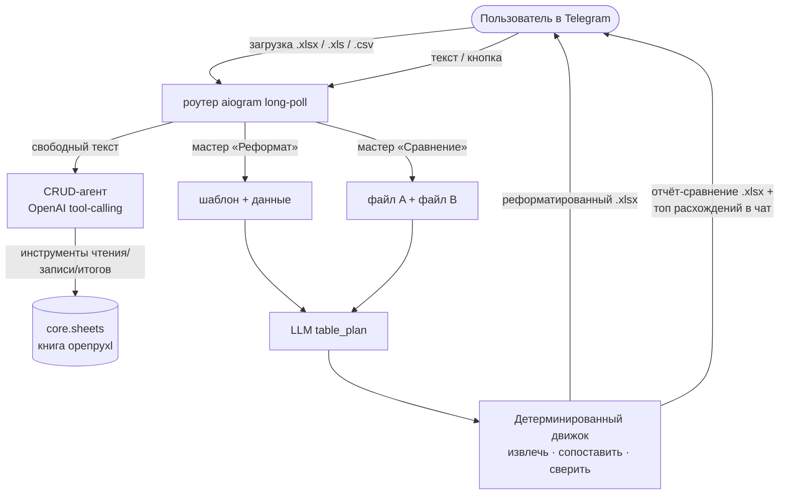

# Excel Table Bot

**Телеграм-бот для таблиц: правьте .xlsx в диалоге, приводите «грязные» выгрузки к своему шаблону и сравнивайте два файла по-умному — даже на разных языках.**

[](https://github.com/M1zz1-ai/excel-table-bot/actions/workflows/ci.yml)

[](LICENSE)

Загрузите таблицу в телеграм-бота и работайте с ней тремя способами: **диалог**
(найти / изменить / добавить / пересобрать строки), **реформат** (привести чужую
выгрузку к своему шаблону) и **сравнение** (получить отчёт о расхождениях, точный
до копейки). Бот держит удар о реальные файлы: старые `.xls` со сломанной
кодировкой, печатные выгрузки с шапкой из метаданных и продублированными
колонками, один и тот же товар, названный по-разному (в т.ч. на разных языках) в
двух файлах.

> 🇬🇧 English version: **[README.md](README.md)**.

## Идея, которую стоит забрать

**LLM планирует структуру, а детерминированный движок делает работу.** Модель не
трогает значения ячеек и не считает — она *смотрит* на сырую сетку и возвращает
маленький JSON-план (где строка-заголовок, какие колонки — данные, какая колонка —
ключ), а обычный Python выполняет план ровно по нему. Файл на 3000 строк остаётся
быстрым и точным — и при этом переживает хаос настоящих таблиц:

- **Разбор через `table_plan`.** У реальных выгрузок сверху титул/метаданные,
  заголовок не в строке 0, колонки разрежены, а печатная вёрстка дублирует всю
  таблицу вправо. Модель возвращает `header_row` / `data_start_row` /
  `data_end_row` / `columns[]` (только первый блок); движок извлекает по индексам
  колонок — отбрасывая итоги, повторные заголовки и дубли от разрыва страниц.
  Старые `.xls` **без записи CODEPAGE** (кракозябры `Поставщик` → `Ïîñòàâùèê`)
  автоматически чинятся в cp1251.
- **Сопоставление в 3 уровня.** Строки соединяются сначала по *нормализованному*
  ключу (регистр, пробелы, пунктуация, `ё`, похожие латиница/кириллица), затем
  **нечётко** (`rapidfuzz`, жадно один-к-одному), затем **LLM-досопоставлением**
  для переименований и переводов — например, `гвоздь` ↔ `цвях`. Детерминированная
  подстраховка предпочитает стабильную колонку-код/артикул описательному названию
  (и отвергает порядковый `№`, который склеил бы строки по позиции).
- **Сверка денег.** Разница итогов (Σ A − Σ B) раскладывается на вклады по товарам —
  «есть только в A», «кол-во 24 → 20» и т.д. — которые всегда сходятся в дельту.
  Отчёт открывается листом «Расхождения», чтобы разбор по товарам был виден сразу.
- **Контроль качества.** Реформат не отправит молча пустой файл: он измеряет, сколько
  заполнилось, и при плохом сопоставлении объясняет, какие колонки совпали, и просит
  описать соответствие словами.

## Архитектура



## Возможности

- **Диалоговый CRUD.** Свободные инструкции («сколько всего по колонке выручка?»,
  «добавь строку», «перепиши строку 12») управляют инструментами над таблицей;
  агент находит строку-заголовок, детерминированно суммирует числа в текстовом виде
  (`1 234,56`, `828,62 EUR`) и никогда не выдумывает значения.
- **Реформат по шаблону.** Загрузите шаблон (с пометками `*обязательное*` и
  необязательной колонкой-константой `CID`) + исходную выгрузку; LLM сопоставляет
  колонки источник→шаблон, движок заполняет строки. Гейт по заполнению не даёт
  отправить пустой файл.
- **Умное сравнение.** Загрузите два файла — получите продукт-ориентированный отчёт:
  «Расхождения», «Почему разница» (сверка денег), «Итог», плюс «Только в A / B» — и
  список крупнейших расхождений прямо в чат.
- **Надёжный разбор.** `.xlsx` / `.xlsm` / `.xls` (с починкой кодировки) / `.csv` /
  `.tsv`; формат определяется по сигнатуре байтов, а не по (поддельному) имени файла.
- **Устойчивость по дизайну.** Каждый вызов модели/Telegram обёрнут в защиту
  (`core/errors.py`): временный сбой логируется и уходит в алерт, но не роняет
  long-poll.

## Быстрый старт

**Требуется:** Python 3.14, [uv](https://docs.astral.sh/uv/), запущенный Redis
(`redis://localhost:6379` по умолчанию), токен бота от
[@BotFather](https://t.me/BotFather) и ключ OpenAI.

```bash
uv sync                          # создать venv и поставить зависимости
cp .env.example .env             # затем впишите реальные значения в .env
uv run python -m excel --check   # проверить конфиг (без сети)
uv run python -m excel           # запустить long-poll-роутер
```

Отправьте боту `/start` и загрузите таблицу. Кнопки клавиатуры — **Реформат** /
**Сравнение**, либо просто пишите текст для правок; `/send` вернёт текущий файл.

Шаблон для продакшн-деплоя — в [`deploy/`](deploy/) (замените `CHANGE_ME`).

## Настройка

| Переменная | Обязательна | Назначение |
|---|---|---|
| `TELEGRAM_BOT_TOKEN_TABLE` | ✅ | Токен бота от @BotFather. |
| `OPENAI_API_KEY` | ✅ | CRUD-агент, `table_plan`, план сравнения, 3-й уровень. |
| `TELEGRAM_CHAT_ID` | ✅ | Chat id владельца для алертов (можно несколько через запятую). |
| `REDIS_URL` | — | Состояние мастеров/сессий (по умолчанию `redis://localhost:6379`). |
| `EXCEL_MODEL` | — | Переопределить модель OpenAI. |

## Разработка

```bash
uv run pytest -q        # тесты движка / мастеров / разбора (без сети)
uv run ruff check .     # линтер
```

Движок чистый и без LLM: каждый вызов модели *инъектируется* как callable, поэтому
`table_plan`, план сравнения и 3-й уровень мокаются в тестах. Реальные вызовы
модели живут только в обвязке бота.

## Лицензия

MIT — см. [LICENSE](LICENSE).
